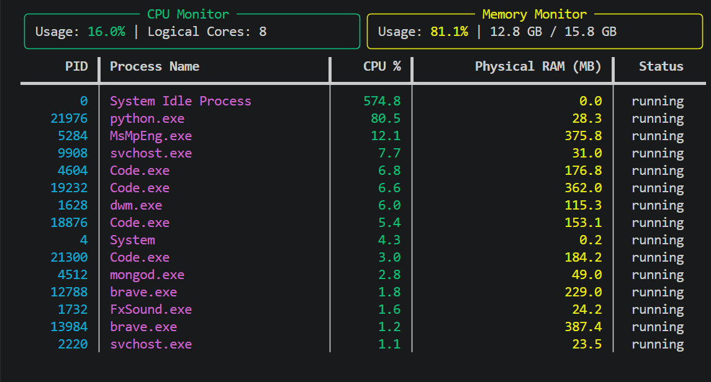

# System Resource Monitor

A real-time terminal-based system resource monitoring application built using **Python**, **psutil**, and **Rich**.

## Features

- Real-time CPU monitoring
- Real-time Memory monitoring
- Displays top running processes
- Shows CPU and RAM usage for each process
- Displays process status
- Color-coded CPU and memory usage indicators
- Updates every 0.5 seconds
- Graceful exit using `Ctrl + C`

## Technologies Used

- Python
- psutil
- Rich
## How It Works

The application uses the psutil library to collect real-time system metrics and Rich to render a live terminal dashboard.

CPU and memory statistics are refreshed every 0.5 seconds while active processes are sorted by CPU usage to display the most resource-intensive tasks.

## Project Structure

```
system-resource-monitor/
│── monitor.py
│── requirements.txt
│── README.md
```

## Installation

Clone the repository:

```bash
git clone https://github.com/kostubh2005/System-Resource-Monitor.git
```

Move into the project directory:

```bash
cd system-resource-monitor
```

Install the required packages:

```bash
pip install -r requirements.txt
```

Run the application:

```bash
python monitor.py
```

## Output

The application displays:

- CPU utilization
- Memory utilization
- Top CPU-consuming processes
- Physical memory usage per process
- Process status

The dashboard refreshes automatically every 0.5 seconds.
## 📸 Screenshot



## Future Improvements

- Disk usage monitoring
- Network monitoring
- GPU monitoring
- Historical usage graphs
- Export metrics to CSV

## License

This project is licensed under the MIT License.

## 👨‍💻 Author

**Kostubh Birla**

GitHub: https://github.com/kostubh2005
